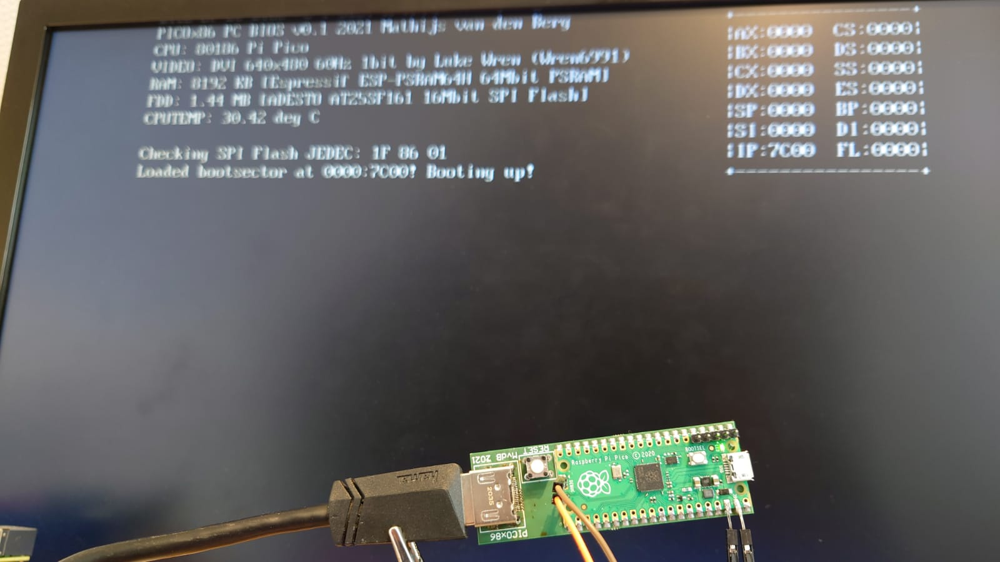

# picox86
x86 emulator on Raspberry Pi Pico

Several opcodes implemented, more to go. Now in color and realtime register display

PCB front, got some awful cheap solder at home, better get some good quality solder

PCB back fitted with RAM and FLASH (and some decoup + tank capacitors) and the 8 270 Ohm resistors

First attempts for basic output in VGA 16x8 font

Getting CPU temperature, start with register output

2021-03-03 FLASH working, can read out JEDEC to verify, print out CPU regs realtime and read first sector to boot from to 0000:7C00 (INT 0x19). Will put some initial sources online soon

Quick links:

[Wren6991 PicoDVI](https://github.com/Wren6991/PicoDVI)

[Next186](https://opencores.org/projects/next186_soc_pc/)

About this Project
-----------------

I started this project inspired by the fact that the Pi Pico can actually output DVI streams without any external component (only 8 resistors and a connector). This is found and proved by Engineer Wren6991 (Check his PicoDVI repository [here](https://github.com/Wren6991/PicoDVI))

A similar x86 project is also made by Nicolae Dumitrache with his FPGA version of a 80186. This is a complete working solution, however I think it would be very cool if a simple MCU can have a minimal implementation too using PIO,DMA and some trial and error.

Hardware used on bottom of PCB:

- SPI Flash chip 16Mbit (for storing FDD image to boot from, Goal is that this can be programmed in circuit by USB or TTL UART)
- QSPI PSRAM 64Mbit (can clock up to 133 MHz / 4bit) which results in up to 66 Mbyte/sec sequential access and about 13 Mbyte/sec random access. Goal is to offload the RAM access with PIO and a small cache.

